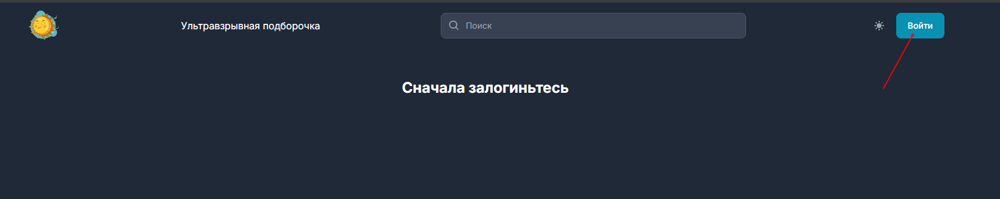
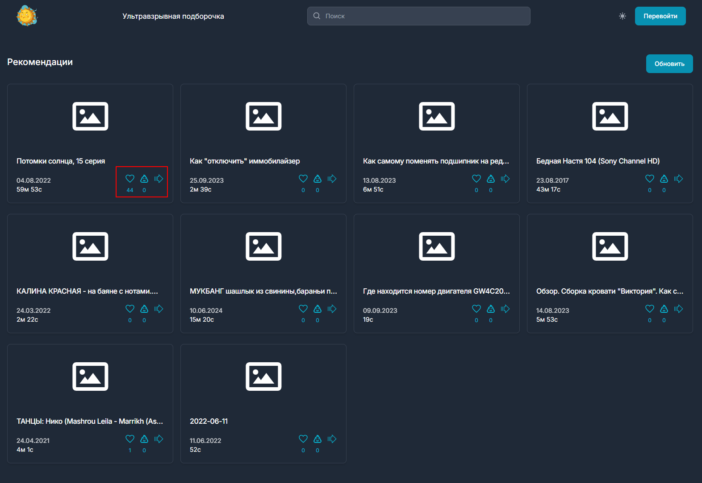
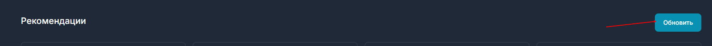
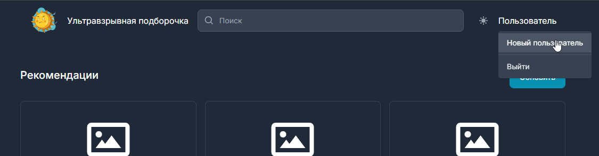
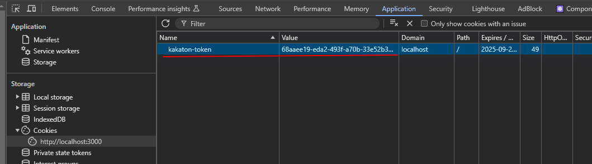

## Запуск сервера

Бэкенд
Написан на .net 8, публикуется как самостоятельное приложение, без необходимости установки .net на целевую систему.
В дополнение к приложению используется БД qdrant, идет в комплекте с приложением в виде исполняемого файла qdrant.exe.

### Как запускать бэк
1. Запустить qdrant.exe из каталога binary в каталоге приложения
2. Запустить Hencoder.exe из каталога приложения

Как работают рекомендации
Приложение при старте загружает предварительно сформированные эмбеддинги, из sqlite таблицы в qdrant.
При запросе от пользователя следующего набора рекомендаций приложение выполняет следующие шаги:
1. Собирает идентификаторы видео которые уже отображались пользователю (RecSys.cs line 92)
2. Собирает идентификаторы видео для которых пользователь поставил лайк (RecSys.cs line 104), набор точек - positive, в терминологии qdrant
3. Собирает идентификаторы видео для которых пользователь поставил дизлайк (RecSys.cs line 106), набор точек - negative, в терминологии qdrant
4. Формирует запрос в qdrant, с указанием не искать в уже просмотренных идентификаторах, начинать поиск вблизи positive точек, и подальше от negative.
5. В случае недоступности qdrant, приложение вернет 10 случайных видео из БД  sqlite, с исключением ранее просмотренных.

При полностью холодном старте, когда нет истории просмотра, в качестве positive точек используется 10 самых комментируемых видео. (RecSys.cs line 133)

Приложение собрано под платформу Windows x64. Однако код написан платформеннонезависимо и может быть собран под linux и macOS.

## Запуск клиента

Должен быть установлен node js версии не ниже 18.18

Необходимо перейти в папку client

```
cd client
```

Установить зависимости

```
npm i
```

В папке client создать файл .env и указать в нём адрес сервера (пример в файле .env.example)

```
API_URL="http://localhost:5000/api"
```

Выполнить билд приложения

```
npm run build
```

Можно запускать

```
npm start
```

## Как пользоваться приложением

По умолчанию клиент доступен на 3000 порту, т.е. в браузере необходимо перейти по адресу http://localhost:3000

При первом входе необходимо сгенерировать новый токен пользователя, т.е. нажать на кнопку Войти



В случае успешного логина пользователю сразу же будет выдана подборка видео, каждое из которых можно отметить как понравившееся, непонравившееся, или как видео, которое следует пропустить



Чтобы обновить подборку, необходимо нажать кнопку Обновить справа



Для проверки рекомендаций под новым пользователем можно нажать кнопку Перевойти в выпадающем меню. Будет сгенерирован новый токен, и подборку можно настроить сначала



Чтобы полностью разлогиниться, необходимо нажать кнопку Выйти в выпадающем меню. После этого можно будет Войти заново


