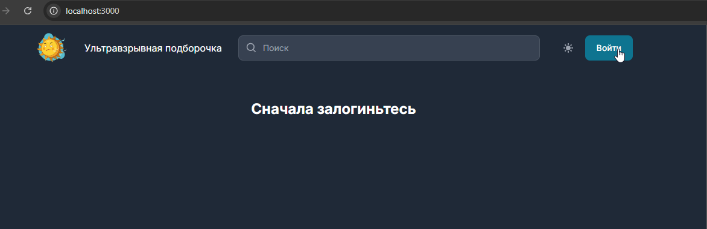
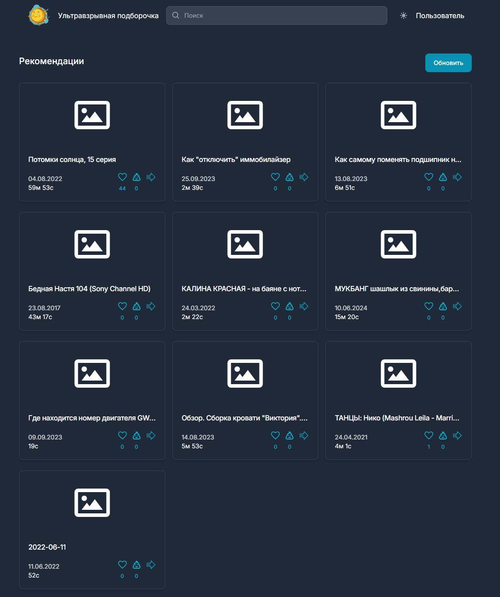
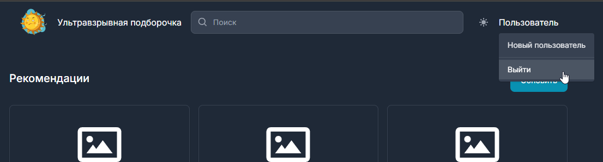

## Запуск клиента

Должен быть установлен node js версии не ниже 18.18

Необходимо перейти в папку client

```
cd client
```

Установить зависимости

```
npm i
```

В папке client создать файл .env и указать в нём адрес сервера (пример в файле .env.example)

```
API_URL="http://localhost:5000/api"
```

Выполнить билд приложения

```
npm run build
```

Можно запускать

```
npm start
```

## Как пользоваться приложением

По умолчанию клиент доступен на 3000 порту, т.е. в браузере необходимо перейти по адресу http://localhost:3000

При первом входе необходимо сгенерировать новый токен пользователя, т.е. нажать на кнопку Войти



В случае успешного логина пользователю сразу же будет выдана подборка видео, каждое из которых можно отметить как понравившееся, непонравившееся, или как видео, которое следует пропустить



Чтобы обновить подборку, необходимо нажать кнопку Обновить справа


Для проверки рекомендаций под новым пользователем можно нажать кнопку Перевойти. Будет сгенерирован новый токен, и подборку можно настроить сначала


Чтобы полностью разлгиниться, можно удалить куку `kakaton-token` и обновить страницу


